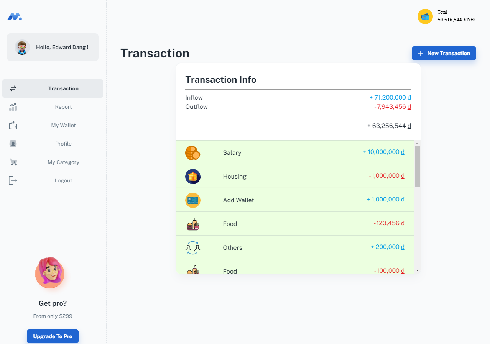

## Money Manager Master

> Web application to manage spending, reimagining Money Lover application

## Before you start

- Clone the Back-end application at: https://github.com/kienbui195/Money-Manager-BE-ExpressJS

## Getting started

- Recommended `node js 16.x` and `npm 6+`. (suggestion v16.15.0)
- Install dependencies: `npm install` / `yarn install`
- Start the project: `npm start` / `yarn start`

## Contact us

Email Us: ddtho95@gmail.com

## Template from

https://github.com/minimal-ui-kit/material-kit-react
